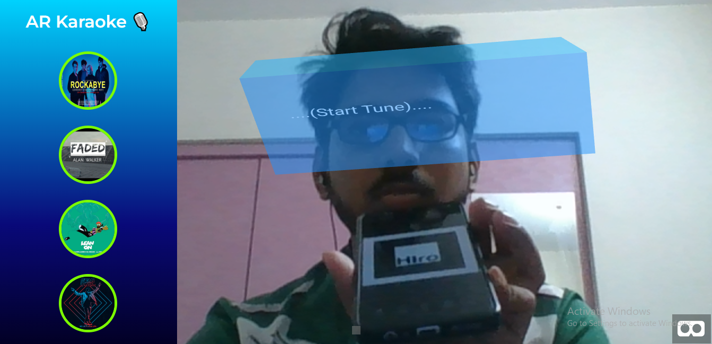
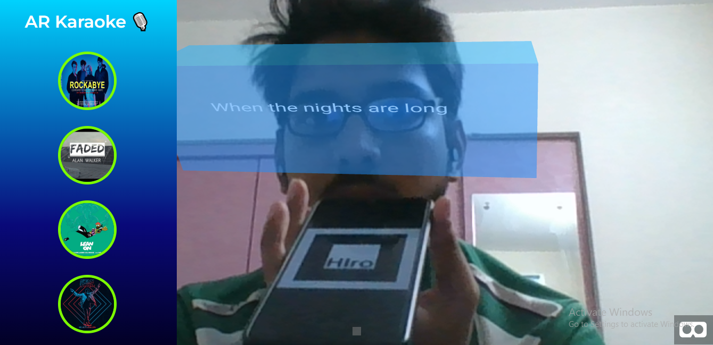
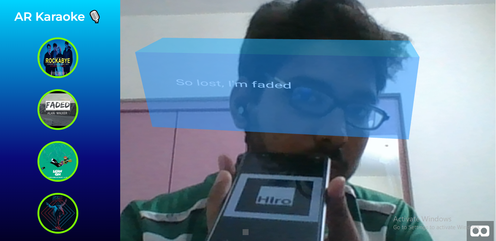

# Final Year AR Project
This project uses `ArJs` and `Aframe` for Augmented Reality Implementation :
## How To Use This Repo
Download this repo and run in `VScode` with extension `Live Server`  and you are done 

### `Lyrics fetched via spotify-lyrics-api`

Open [https://spotify-lyric-api.herokuapp.com](https://spotify-lyric-api.herokuapp.com/) to view it in your browser.\
The App has `4 Songs with Guide Melody`

### `Songs are`

`1. Rockabye`\
`2. Faded`\
`3. Lean On`\
`4. No Lie`

## `Final Output`

`..... (Start Tune) ....`

`Lean On lyrics`

`Faded Lyrics`